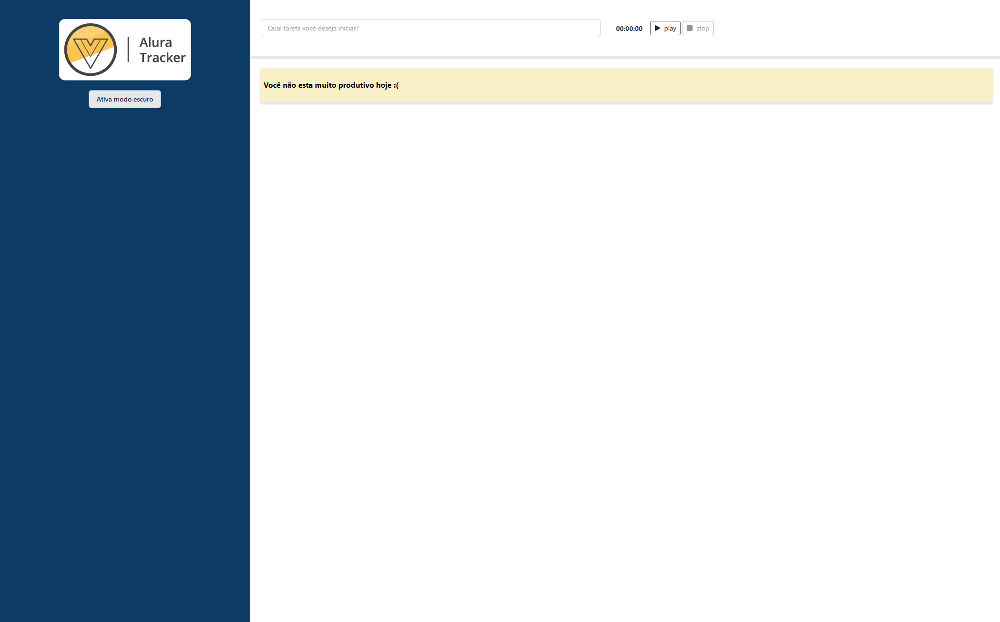

# ⏱️ Alura Tracker

Projeto desenvolvido durante o curso da **Alura**, com o objetivo de aplicar conceitos práticos de **Vue.js 3 com TypeScript**.

Este aplicativo funciona como um **cronômetro de tarefas**, permitindo adicionar atividades e acompanhar o tempo gasto em cada uma.

---

## 🚀 Funcionalidades

✅ Cadastro de tarefas com descrição
✅ Temporizador individual para cada tarefa
✅ Exibição do tempo formatado (mm:ss)
✅ Lista dinâmica de tarefas com atualização em tempo real
✅ Componentização utilizando Vue 3 + Composition API
✅ Tipagem forte com TypeScript (ITask) para maior segurança
✅ Estilização moderna e responsiva com Tailwind CSS
✅ Ícones integrados com Font Awesome para melhor UI/UX

---

## 📦 Tecnologias utilizadas

- [Vue 3](https://vuejs.org/)
- [TypeScript](https://www.typescriptlang.org/)
- [Vite](https://vitejs.dev/)
- [Tailwind CSS](https://tailwindcss.com/)
- [Font Awesome](https://fontawesome.com/)
- [Vercel](https://vercel.com/) – Deploy

---

## 🔗 Acesse o projeto online

👉 [Clique aqui para acessar o site publicado na Vercel](https://alura-traker-six.vercel.app)

> Substitua o link acima se o seu domínio no Vercel for diferente.

---

## 📁 Estrutura dos Componentes

- `Form.vue`: formulário de criação de tarefa
- `Tasks.vue`: exibição das tarefas em lista
- `Stopwatch.vue`: componente do cronômetro
- `utils/FormatTime.ts`: função para formatar tempo
- `interfaces/ITask.ts`: tipagem da tarefa

## 🤳 Demostração



## 🧪 Executar localmente

```bash
# Instale as dependências
npm install

# Execute o projeto em modo dev
npm run dev

# Gere a build de produção
npm run build

## 🖼️ Demonstração

```

<!--
Obs

 Parar o servidor de desenvolvimento: O primeiro passo é interromper o servidor que você estava usando durante o desenvolvimento (npm run serve).

Analisar os scripts no package.json: O arquivo package.json contém scripts que automatizam tarefas como iniciar o servidor de desenvolvimento (serve), compilar a aplicação para produção (build) e executar linters (lint).

Executar o script build: Para compilar a aplicação, você deve executar o comando npm run build. Esse script irá processar seus componentes e gerar os arquivos otimizados para produção na pasta dist com (npm i -g http-server).

Testar a aplicação compilada: Para verificar se a compilação foi bem-sucedida, você pode usar um servidor HTTP simples como o (http-server) para servir os arquivos da pasta dist localmente.

Entender a otimização para produção: A versão compilada da aplicação é minificada e otimizada para melhor desempenho em produção, removendo espaços e comentários desnecessários. -->
