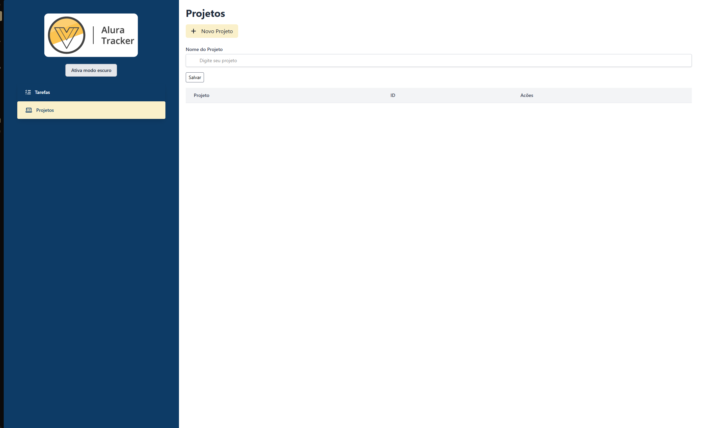

# ⏱️ Alura Tracker

Projeto desenvolvido durante o curso da **Alura**, com o objetivo de aplicar conceitos práticos de Vue.js 3 com TypeScript.

Este aplicativo funciona como um **cronômetro de tarefas**, permitindo adicionar atividades e acompanhar o tempo gasto em cada uma.

## 🚀 Funcionalidades

- ✅ Cadastro de tarefas com descrição
- ✅ Temporizador para cada tarefa
- ✅ Exibição do tempo formatado (mm:ss)
- ✅ Lista de tarefas atualizável
- ✅ Componentização com Vue 3 + Composition API
- ✅ Tipagem com TypeScript (`ITask`)
- ✅ Estilização com Tailwind CSS
- ✅ Ícones com Font Awesome

## 📦 Tecnologias utilizadas

- [Vue 3](https://vuejs.org/)
- [TypeScript](https://www.typescriptlang.org/)
- [Vite](https://vitejs.dev/)
- [Tailwind CSS](https://tailwindcss.com/)
- [Font Awesome](https://fontawesome.com/)
- [Vercel](https://vercel.com/) (deploy)

## 🔗 Acesse o projeto online

👉 [Clique aqui para acessar o site publicado na Vercel](https://alura-traker-six.vercel.app)

> Substitua o link acima com a URL gerada pela Vercel para o seu projeto.

## 📁 Estrutura dos Componentes

- `Form.vue`: formulário de criação de tarefa
- `Tasks.vue`: exibição das tarefas em lista
- `Stopwatch.vue`: componente do cronômetro
- `utils/FormatTime.ts`: função para formatar tempo
- `interfaces/ITask.ts`: tipagem da tarefa

## 🧪 Executar localmente

```bash
# Instale as dependências
npm install

# Execute o projeto em modo dev
npm run dev

# Gere a build de produção
npm run build

## 🖼️ Demonstração




#Obs
# Parar o servidor de desenvolvimento: O primeiro passo é interromper o servidor que você estava usando durante o desenvolvimento (npm run serve).
# Analisar os scripts no package.json: O arquivo package.json contém scripts que automatizam tarefas como iniciar o servidor de desenvolvimento (serve), compilar a aplicação para produção (build) e executar linters (lint).
# Executar o script build: Para compilar a aplicação, você deve executar o comando npm run build. Esse script irá processar seus componentes e gerar os arquivos otimizados para produção na pasta dist com  (npm i -g http-server).
# Testar a aplicação compilada: Para verificar se a compilação foi bem-sucedida, você pode usar um servidor HTTP simples como o (http-server) para servir os arquivos da pasta dist localmente.
# Entender a otimização para produção: A versão compilada da aplicação é minificada e otimizada para melhor desempenho em produção, removendo espaços e comentários desnecessários.
```
